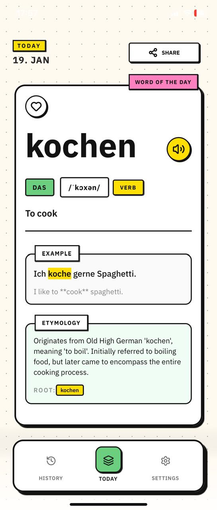

# Wortday 🇩🇪

**Wortday** is an aesthetic German language learning companion built on the "Word of the Day" concept. Designed with a focus on micro-learning and visual appeal, it helps users expand their vocabulary one card at a time.

<p align="center">
  
</p>

## ✨ Features

- **"Word of the Day" Concept**: Focus on one essential word every day to avoid cognitive overload.
- **Neobrutalism Design**: A bold, modern, and vibrant interface with sharp accents and a unique aesthetic.
- **Smart Content**: Each word includes its article (color-coded), transcription, usage examples, and etymology.
- **Level System**: Content adapts to your proficiency level (Beginner, Intermediate, Advanced).
- **Multilingual UI**: The app is available in English, German, Russian, and Ukrainian.
- **Universal App**: Seamless experience across iOS, Android, and Web (PWA).
- **Cloud Sync**: All your progress, favorites, and history synced via Supabase.
- **Authentication**: Secure sign-in with Email/Password, Apple, or Google.

## 🚀 Capabilities

- **Personalization**: A smooth onboarding flow to set your learning level and preferences.
- **History & Favorites**: Save interesting words and review your learning history anytime.
- **Reminders**: Customizable notifications to ensure you never miss your new word of the day.
- **Responsive Layout**: Optimized for all devices, from small smartphones to desktop browsers.

## 🛠 Tech Stack

Built with a modern tech stack to ensure performance and cross-platform compatibility:

- **Framework**: [Expo](https://expo.dev) + [React Native](https://reactnative.dev)
- **Navigation**: [Expo Router](https://docs.expo.dev/router/introduction/) (file-based routing)
- **Styling**: [NativeWind](https://www.nativewind.dev) (Tailwind CSS) + [Reanimated](https://docs.swmansion.com/react-native-reanimated/)
- **State Management**: [Zustand](https://github.com/pmndrs/zustand) with persistent storage
- **Backend**: [Supabase](https://supabase.com) (PostgreSQL + Row Level Security)
- **Authentication**: Supabase Auth (Email, Apple Sign In, Google OAuth)
- **Icons**: [Lucide React Native](https://lucide.dev)

## 📦 Installation & Setup

1. Clone the repository:
   ```bash
   git clone https://github.com/iavilov/wortday.git
   cd wortday
   ```

2. Install dependencies:
   ```bash
   npm install
   ```

3. Set up environment variables:
   ```bash
   cp .env.example .env
   ```
   Add your Supabase credentials to `.env`:
   ```
   EXPO_PUBLIC_SUPABASE_URL=your_supabase_url
   EXPO_PUBLIC_SUPABASE_ANON_KEY=your_supabase_anon_key
   ```

4. Start the development server:
   ```bash
   npm start
   ```

5. Run on specific platforms:
   ```bash
   npm run web      # Web browser
   npm run ios      # iOS simulator
   npm run android  # Android emulator
   ```

## 🎯 Project Status

**Version:** 1.0.0 (Production Ready)

✅ **Completed:**
- Neobrutalism UI design system
- Word of the Day with level-based sequencing
- Supabase integration (authentication, database, RLS)
- Favorites & History with cloud sync
- Multi-device support with automatic data sync
- Onboarding flow
- Settings management (language, level, notifications)

🚧 **In Progress:**
- Audio pronunciation for words
- Push notifications
- Production Apple Sign In & Google OAuth setup

📋 **Roadmap:**
- Spaced Repetition System (SRS) for review
- Streak tracking & gamification
- Daily learning statistics
- Content expansion (1095+ words across all levels)

## 📚 Documentation

For developers and contributors:

- **[Tech Stack](./docs/tech-stack.md)** - Detailed overview of technologies used
- **[Database Schema](./docs/database-schema.md)** - Supabase database structure and RLS policies
- **[Authentication Flow](./docs/auth-flow.md)** - Auth system architecture
- **[Coding Conventions](./docs/coding-conventions.md)** - React Native best practices
- **[Supabase Race Conditions](./docs/supabase-race-conditions.en.md)** - Critical bug documentation for testing
- **[AI Workflow Guide](./docs/ai-workflow-guide.md)** - Working with AI assistants

## 🏗️ Architecture

**Design Pattern:** RLS-First Pattern
- Security enforcement at database level (Supabase Row Level Security)
- Minimized async auth calls to prevent race conditions
- Optimistic UI updates with automatic rollback on errors

**State Management:**
- `auth-store.ts` - Authentication state with Supabase session sync
- `word-store.ts` - Word content, favorites, and history
- `settings-store.ts` - User preferences with AsyncStorage persistence

**Service Layer:**
- All Supabase operations isolated in service files
- No direct database access from UI components
- Comprehensive error handling and logging

## 🤝 Contributing

Contributions are welcome! Please check out the [coding conventions](./docs/coding-conventions.md) before submitting a PR.

## 📄 License

This project is licensed under the MIT License.

---

*Developed with a love for the German language and great design.*
